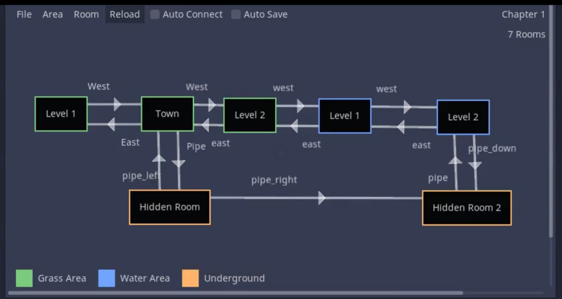

# WorldEditor
A Godot plugin for World Editing tool to create connections between levels



How to install :
1. clone the repo. and copy the addons folder to your project
2. go to project settings > addons > enable the world editor plugin

How to use :
1. Create a chapter and save it somewhere. This file will contain all the areas, and rooms of the game
2. Create a few areas and give them a colour code.
3. Create a room for that area. Then open the created room resource file, assign the scene you want to associate to that room.
4. You're ready to go.

How to edit area/rooms:
- To edit an area, click on the area legend on the bottom left, and the area data will apppear on the inspector
- To edit a room, click on the room node, and the room data will appear on the inspector

How to create conenctions:
1. Click on the room node. Then, on the inspector, type in the names for each loading zone
2. Right click on the room node. A menu with a list of loading zones will appear, choose the loading zone you want to conenct.
3. Right click on another room node, and choose the second loading zone you want to connect.
4. The two loading zones are now connected

How to use the stored room data and the loading zones inside the game:
1. Create an area2D or some sort of trigger you wish to use as a loading zone.
2. Insert the room data resource into an exported resource variable inside a script.
3. export an int variable that represents the loading zone id to be loaded
4. Use the get_next_scene_path(zone_id:int) to get the next scene path
5. Use that scene path to call get_tree().change_scene(next_scene_path)
Example:
```python
extends Area2D

export(Resource) var room_data:Resource
export(int) var zone_id:int

func _on_Area2D_body_entered(body):
    var next_scene_path = room_data.get_next_scene_path(zone_id)
    get_tree().change_scene(next_scene_path)
```

*There are two functions you can use inside the room data resource : get_all_zone_names() and get_next_scene_path(zone_id:int)
